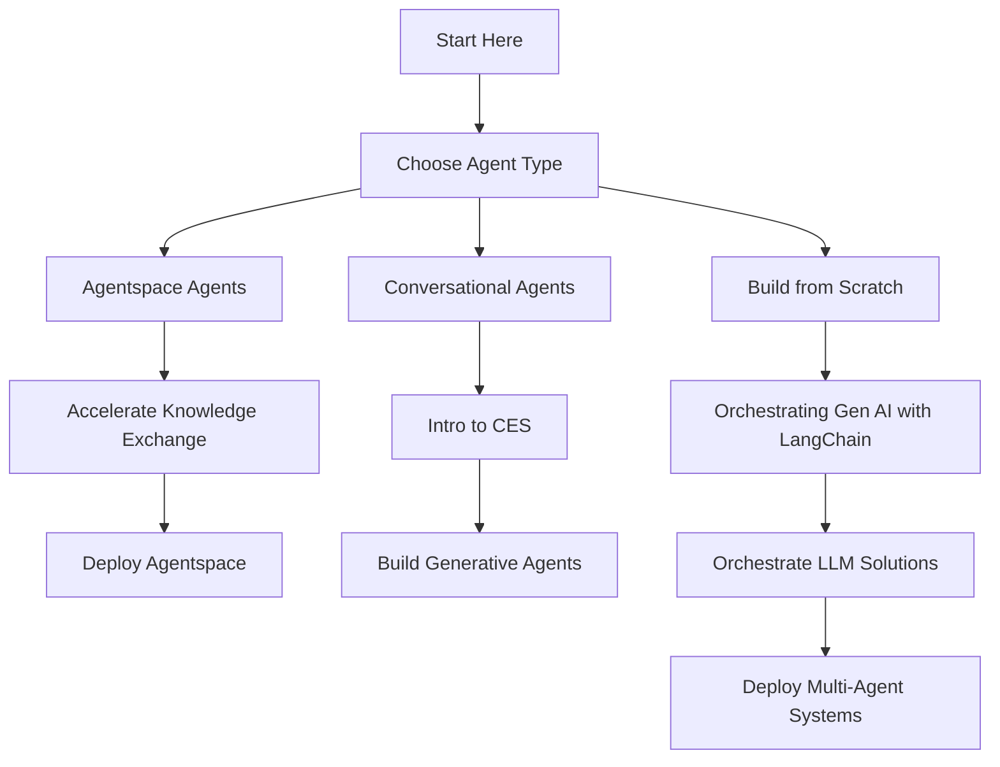

# Build Agents with Google AI 🤖🔍

## Overview 🌟
This repository serves as a comprehensive collection of courses and labs focused on building AI agents using Google technologies. AI agents are interactive partners designed to answer complex questions and complete tasks, making them valuable tools for various applications.

## What Are AI Agents? 🧠
AI Agents are interactive systems that can help:
- 💬 Answer complex questions
- ⚙️ Perform tasks on your behalf
- 🔎 Assist with information retrieval and processing
- 📊 Automate workflows and business processes

## Agent Types and Use Cases 📚

### 🏢 Agentspace Agents
**Purpose**: Create employee productivity and enterprise search agents

| Course | Duration | Level | Description |
|--------|----------|-------|-------------|
| **Accelerate Knowledge Exchange with Agentspace** | 4 hours | Introductory | Learn how to use Agentspace to help employees find specific information from document storage, email, chats, ticketing systems, and other data sources through a single search bar. |
| **Deploy Agentspace** | 2 hours | Introductory | Develop the ability to deploy Google Agentspace, set up data stores, and configure actions. This skill badge is a practical application of concepts learned in "Accelerate Knowledge Exchange with Agentspace." |

### 🗣️ Conversational Agents
**Purpose**: Build customer service and support agents with low-code, fully managed enterprise conversation software (Dialogflow)

| Course | Duration | Level | Description |
|--------|----------|-------|-------------|
| **Introduction to CES and Conversational Agents** | 2 hours | Intermediate | Explore different products and capabilities of Customer Engagement Center (CES) and Conversational agents, covering foundational principles of conversation design for creating engaging experiences. |
| **Build Generative Virtual Agents with API Integrations** | 1.5 hours | Advanced | Create and deploy generative virtual agents with natural language using Vertex AI Agent Builder, augmenting responses by integrating Gemini with third-party APIs and custom data stores. |

### 🛠️ Build from Scratch (Vertex AI)
**Purpose**: Full control for building DIY agents using frameworks like LangChain, CrewAI, and deployment on Vertex AI Agent Engine

| Course | Duration | Level | Description |
|--------|----------|-------|-------------|
| **Orchestrating Gen AI Applications with LangChain** | 9 hours | Advanced | Equip full-stack developers with skills to integrate generative AI features into applications using LangChain, leveraging its capabilities for backend flows and seamless model execution. |
| **Orchestrate LLM Solutions with LangChain** | 4 hours | Intermediate | Learn to use LangChain to call Google Cloud LLMs and Generative AI Services and Datastores to simplify code for complex applications. |
| **Deploy Multi-Agent Systems with Agent Development Kit and Agent Engine** | 6 hours | Advanced | Use the Google Agent Development Kit to build complex, multi-agent systems equipped with tools and connected through parent-child relationships. |

## Learning Pathway 🛣️

## Course Structure 📋

Each course in this repository follows a structured approach to help you learn effectively:
- 📖 Theoretical concepts and background
- 🔧 Hands-on exercises and labs
- 🚀 Practical applications and use cases
- 🏆 Assessment and skill validation

## Prerequisites ✅

While specific prerequisites vary by course, a general understanding of the following is recommended:
- 💻 Basic programming concepts
- ☁️ Familiarity with cloud computing
- 🧮 Basic understanding of AI and machine learning fundamentals

## Getting Started 🚀

1. Choose a learning path based on your interests:
   - Agentspace for enterprise search solutions
   - Dialogflow for conversational agents
   - Vertex AI for building custom agents from scratch

2. Complete the introductory courses before moving to advanced topics
3. Apply the skills in the hands-on labs and exercises
4. Earn badges by completing the assessments

## Resources 📚

- [Google Cloud Documentation](https://cloud.google.com/docs)
- [Vertex AI Documentation](https://cloud.google.com/vertex-ai/docs)
- [Dialogflow Documentation](https://cloud.google.com/dialogflow/docs)
- [LangChain Documentation](https://python.langchain.com/docs/get_started/introduction)

## Contribution 👥

Contributions to this repository are welcome. Please feel free to submit issues or pull requests if you have suggestions for improvements or additional resources.

## License 📄

This project and its associated materials are subject to the license terms included with each course and lab.
